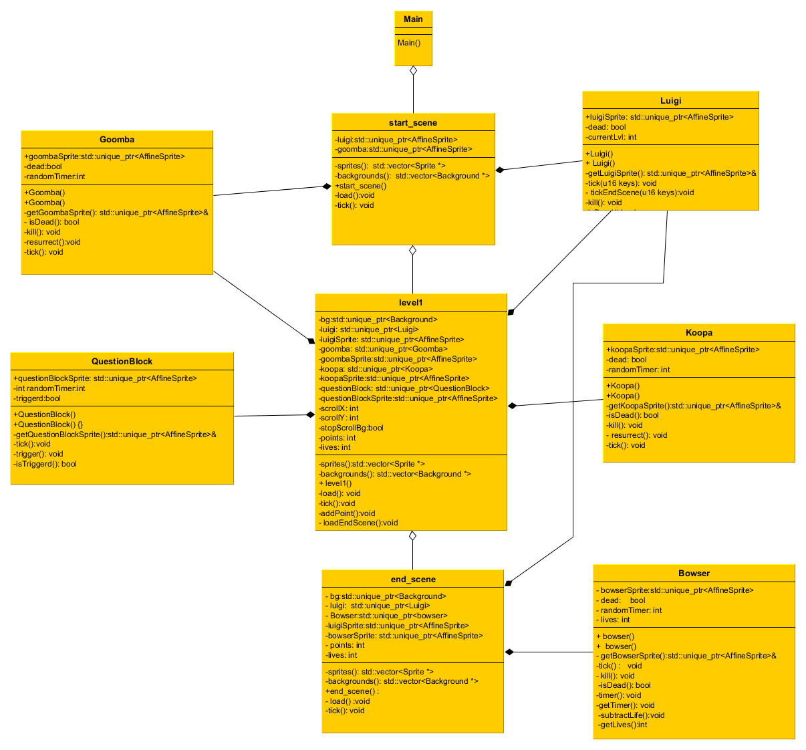

## Dragonball demo for GBA

### Information
This is a project for [3433 Softwareontwerp met C/C++ en Qt](https://uhintra03.uhasselt.be/studiegidswww/opleidingsonderdeel.aspx?a=2018&i=3433&n=4&t=01). The goals of this project was creating a GBA demo based on the [gba-sprite-engine](https://github.com/wgroeneveld/gba-sprite-engine) of [wgroeneveld](https://github.com/wgroeneveld). The demo I created is a 2D fighting game that's inspired on the classic dragonball series, you're fighting with the saiyan kid goku (孫悟空 Son Gokū) also known as kakarot (カカロット Kakarotto) at the world tournament
against yamcha (ヤムチャ yamucha). Because it's just a demo you can  control and fight with goku but yamcha will not defend himself.

### Controls and rules

a: kick 

b: hit

up: kamehameha wave

left or right: moving left or right

green bar is your health bar, blue  bar is your energy bar

The kamehameha wave needs energy, you cannot replenish you energy

The game ends when your opponents health is 0, press start to restart the game

### Disclaimer
 DragonBall is Owned by TOEI ANIMATION, Ltd. and Licensed by FUNimation Productions, Ltd.. All Rights Reserved. DragonBall, DragonBall Z, DragonBall GT and all logos, character names and distinctive likenesses thereof are trademarks of TOEI ANIMATION, Ltd. 

## Superluigi

A GBA game written in c++ by Craeghs Mathias and Vandebosch Remy.

In this game you play as Luigi. He runs through a single level world searching for adventure.
A world filled with monsters that can be slayed by jumping on top of them.
Luigi strives to go forward using the right key and jumping to new heights using the up key.
Luigi can solve all problems using his head. Literally using his head, hit it on the bottom of the questionblock to gain a point.
For every five points an extra life is acquired.

Following picture presents to you the domain model of the game.

## Sonic GBA_game

gebaseerd op: [Engine](https://github.com/wgroeneveld/gba-sprite-engine)

Sonic kan in elke richting lopen. Daarbij kan je sonic een bal laten worden tijdens het lopen door KEY_DOWN eenmaling in te duwen.
Sonic heeft een hogere snelheid wanneer hij zich in balvorm bevindt. Verder kan je alle movement keys gebruiken om te bewegen(KEY_RIGHT = move rechts, KEY_UP = springen,...)

In level1 moet sonic 3 spikeballs ontwijken om het portaal te bereiken dat hem brengt naar het volgende level.

In level2 moet sonic de spikeball 10 keer goomba-stompen om hem te verslaan.

Beschrijving van het model staat in domain_model folder.

#apple lloyd
De wereld is overgenomen door de boosaardige Windows! Het is jouw taak om deze slechterikken te doden en de wereld te redden van de ondergang.
Jouw wapen: apples! Alleen dit meesterlijke wapen is in staat de windows te verslaan...

Lopen doe je met de pijltjes, appels gooien met x(A op GBA). Enemies hebben 5 HP, jijzelf 1. Ontwijkt de aanvallen van
de windows en versla hen om te winnen. Dood? Herstart door op enter(START op GBA) te drukken.